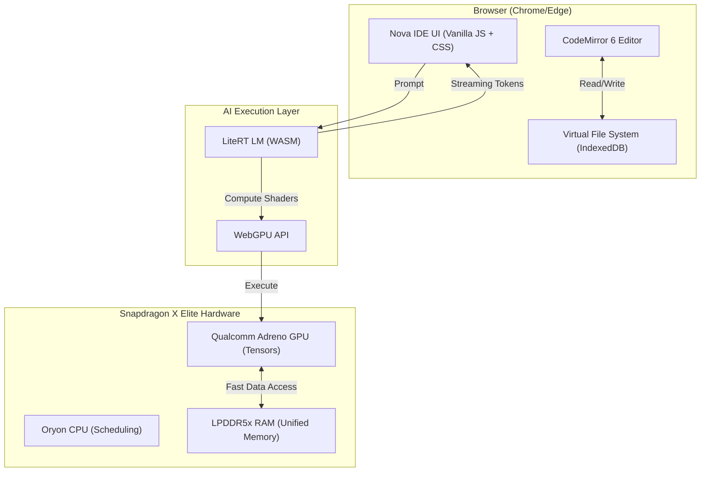

# Nova IDE: Redefining Local Coding with Snapdragon X Elite and WebGPU

In the era of massive cloud-based LLMs, a new frontier is emerging: **On-Device AI**. Today, we’re introducing **Nova IDE**, a browser-based coding environment that proves you don't need a massive server farm to have a world-class AI pair programmer. 

By leveraging the raw power of the **Snapdragon X Elite** and its high-performance **Qualcomm Adreno GPU**, Nova IDE brings high-speed local inference directly into the developer's workflow—entirely in the browser.

---

## 🚀 The Vision: AI at the Edge

Most AI-integrated IDEs rely on heavy cloud APIs. This introduces latency, subscription costs, and—most importantly—privacy concerns. **Nova IDE** flips the script. It uses **LiteRT LM** and **WebGPU** to run Large Language Models (LLMs) locally.

When you run Nova IDE on a machine powered by the **Snapdragon X Elite**, you're not just running a web app; you're utilizing one of the most efficient NPU/GPU architectures ever designed for portable computing.

---

## 🏗️ Detailed Architecture

Nova IDE is built on a "Local-First" philosophy. Here is how the magic happens:

### Architecture Overview (Mermaid Diagram)

### 1. The Inference Engine (LiteRT LM + WebGPU)
At the heart of Nova IDE is the LiteRT LM runtime. Unlike traditional JavaScript which runs on the CPU, Nova IDE uses **WebGPU** to talk directly to the **Qualcomm Adreno GPU**. 
- **WebGPU** allows for massively parallel tensor operations required by transformers.
- On the Snapdragon X Elite, the Adreno GPU provides the floating-point performance needed to generate tokens at lightning speed, rivaling cloud-based solutions.

### 2. The Editor (CodeMirror 6)
For the coding experience, we chose CodeMirror 6 for its modularity and performance. It handles large files with ease and provides a rich extension system for the syntax highlighting and IDE features developers expect.

### 3. Virtual File System (IndexedDB)
Your files are stored in a persistent, browser-based virtual file system. Using IndexedDB, Nova IDE ensures that your workspace is saved locally, works offline, and respects the sandbox of the browser.

---

## 💎 Why Snapdragon X Elite?

The Snapdragon X Elite is a breakthrough for web-based AI. While Intel and AMD have made strides, the unified memory architecture and the specific optimizations in the **Adreno GPU** for compute workloads make it a beast for WebGPU.

- **Unified Memory**: The GPU can access the model weights in RAM without expensive data transfers, which is the primary bottleneck for LLM inference.
- **Power Efficiency**: Running a 2.8B parameter model like Gemma locally can be battery-intensive on traditional x86 laptops. The X Elite’s efficiency allows you to code with AI for hours on end without being tethered to a wall.
- **Hardware Acceleration**: Qualcomm’s drivers for Windows on ARM have optimized WebGPU support, ensuring that Nova IDE hits peak TFLOPS during generation.

---

## 🛠️ Technical Deep Dive: How it Works

When you click **"⚡ Load Local AI Model"** in Nova IDE, the following sequence occurs:

1. **WASM Initialization**: The IDE loads the LiteRT LM WebAssembly runtime.
2. **GPU Adapter Request**: The browser requests a WebGPU adapter. On an X Elite machine, this identifies the **Qualcomm Adreno GPU**.
3. **Model Loading**: The model (in `.litertlm` format) is fetched into a `SharedArrayBuffer`.
4. **GPU Compilation**: The model's computation graph is compiled into GPU-specific kernels.
5. **Streaming Inference**: When you type a prompt, the tokens are generated on the Adreno GPU and streamed back to the UI in real-time.

---

## 🔐 Privacy: Your Code, Your Data

The biggest win for Nova IDE is security. In an era of data leaks and corporate espionage, knowing that your proprietary code never leaves your local machine is invaluable. Nova IDE doesn't even need an internet connection to run the AI once the model is loaded.

---

## 🏁 Conclusion

Nova IDE is more than just a project; it's a peek into the future of software development. As silicon like the **Snapdragon X Elite** becomes the standard, the browser is evolving from a document viewer into a high-performance AI workstation.

**Experience Nova IDE today and build on the edge.**

[**View the Repository on GitHub**](https://github.com/carrycooldude/Nova-IDE)

---
*Author: carrycooldude*  
*Project: Nova IDE*
